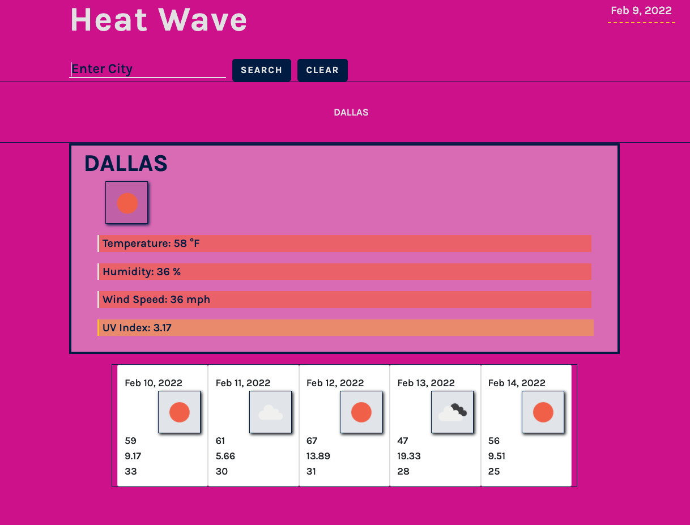

# heat-wave

> If you are not willing to learn, no one can help you. If you are determined to learn, no one can stop you. -Zig Ziglar

## Description

I have created a weather dashboard to allow users to see the weather forecast and conditions for multiple citites.

---

## User Story
```

AS A traveler
I WANT to see the weather outlook for multiple cities
SO THAT I can plan a trip accordingly 
```
---
## Acceptance Criteria
```

GIVEN a weather dashboard with form inputs
WHEN I search for a city
THEN I am presented with current and future conditions for that city and that city is added to the search history
WHEN I view current weather conditions for that city
THEN I am presented with the city name, the date, an icon representation of weather conditions, the temperature, the humidity, the wind speed, and the UV index
WHEN I view the UV index
THEN I am presented with a color that indicates whether the conditions are favorable, moderate, or severe
WHEN I view future weather conditions for that city
THEN I am presented with a 5-day forecast that displays the date, an icon representation of weather conditions, the temperature, the wind speed, and the humidity
WHEN I click on a city in the search history
THEN I am again presented with current and future conditions for that city
```
---


## Important Links

- [Deployed URL](https://caitlyn-griffing.github.io/heat-wave/)

- [GitHub URL](https://github.com/caitlyn-griffing/heat-wave)


---

## Images of Deployed Web Page



<!--  -->

<!--  -->

---
